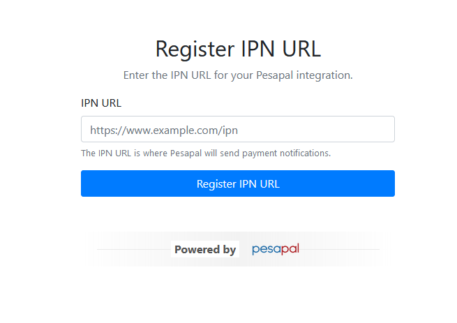
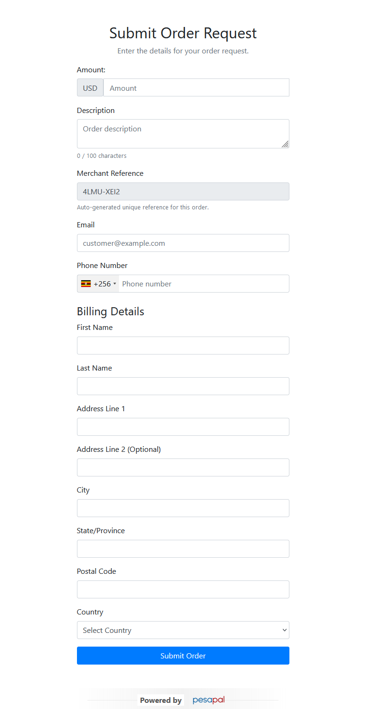
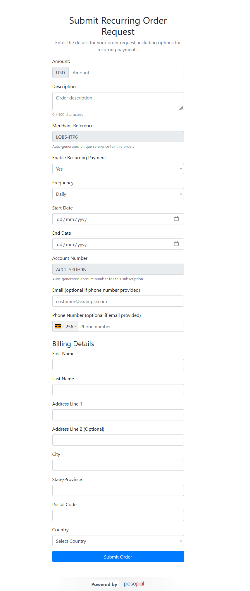
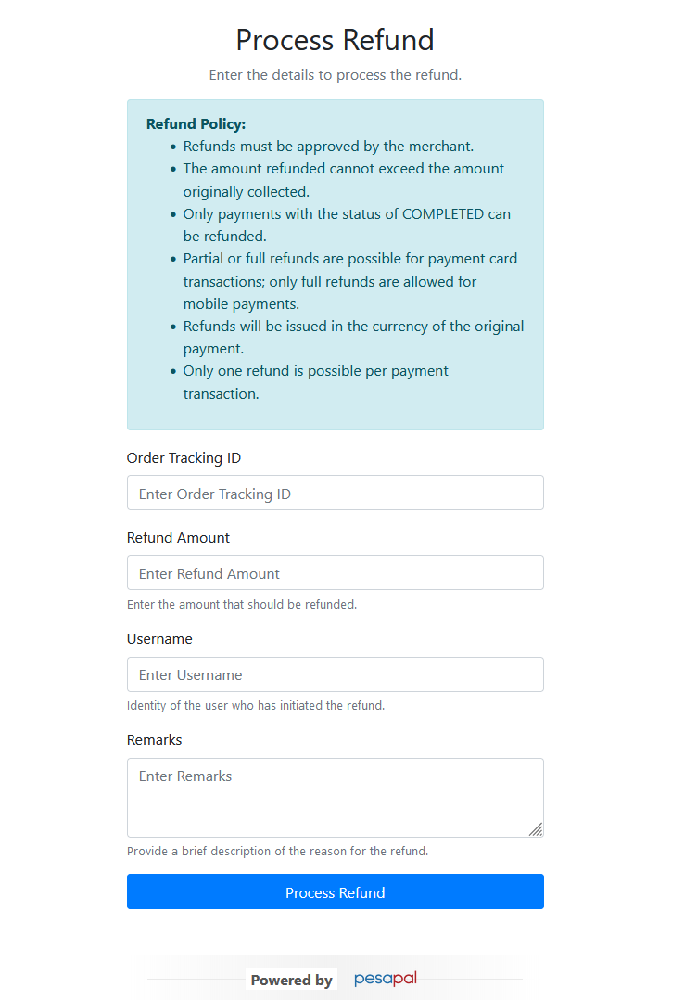
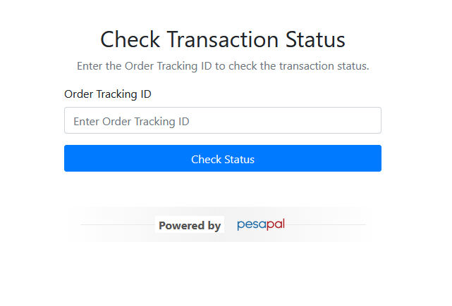

# Pesapal PHP SDK

[](LICENSE)

The **Pesapal PHP SDK** provides a simple and efficient way to integrate the Pesapal Payment Gateway into your PHP application. This SDK handles authentication, order submission, transaction status checks, recurring payments, and refunds, making it easier for developers to interact with Pesapal's API 3.0.

## Table of Contents

- [Pesapal PHP SDK](#pesapal-php-sdk)
  - [Table of Contents](#table-of-contents)
  - [Features](#features)
  - [Requirements](#requirements)
  - [Installation](#installation)
  - [Configuration](#configuration)
  - [Usage](#usage)
    - [Authentication](#authentication)
    - [Important Notice: IPN Registration](#important-notice-ipn-registration)
    - [Register IPN URL](#register-ipn-url)
    - [Submit Order](#submit-order)
    - [Recurring Payments](#recurring-payments)
    - [Refund Request](#refund-request)
    - [Get Transaction Status](#get-transaction-status)
  - [License](#license)

## Features

- **Authentication**: Obtain and manage access tokens using your Pesapal `consumer_key` and `consumer_secret`.
- **IPN Registration**: Register Instant Payment Notification (IPN) URLs to receive real-time transaction status updates.
- **Order Submission**: Create and submit payment requests to Pesapal.
- **Transaction Status**: Check the status of transactions using the `OrderTrackingId`.
- **Recurring Payments**: Set up and manage subscription-based payments.
- **Refunds**: Request refunds for completed transactions.

## Requirements

- PHP 8.0 or higher
- Composer
- cURL extension enabled
- An active Pesapal merchant account with `consumer_key` and `consumer_secret`
- A **sandbox keys file** for testing, provided in the project as `pesapal_sandbox_keys.json`. This file contains test keys for different merchant regions (e.g., Kenya, Uganda, Tanzania). You can find the file in the root directory of the project.

## Installation

Use Composer to install the Pesapal PHP SDK:

```bash
composer require katorymnd/pesapal-php-sdk
```

## Configuration

1. **Clone the Repository (if not using Composer):**

   ```bash
   git clone https://github.com/katorymnd/pesapal-php-sdk.git
   ```

2. **Install Dependencies:**

   Navigate to the project directory and install dependencies:

   ```bash
   cd pesapal-php-sdk
   composer install
   ```

3. **Set Up Environment Variables:**

   - Copy the `.env.example` file to `.env`:

     ```bash
     cp .env.example .env
     ```

   - Open the `.env` file and set your Pesapal `consumer_key` and `consumer_secret`:

     ```env
     CONSUMER_KEY=your_consumer_key_here
     CONSUMER_SECRET=your_consumer_secret_here
     ```

4. **Ensure `pesapal_dynamic.json` is Writable:**

   The SDK uses `pesapal_dynamic.json` to store the `access_token` and other dynamic data. Make sure this file is writable by your application.

## Usage

### Authentication

The SDK automatically handles authentication with Pesapal. Upon initialization, the SDK retrieves the `access_token` using your configured `consumer_key` and `consumer_secret`. The token is valid for 5 minutes and is securely stored in `pesapal_dynamic.json`.

You don't need to manually request or manage the `access_token`; the SDK ensures it is always available and refreshed as needed for API calls.

---

**How it Works:**

1. When you make an API call, the SDK checks for a valid `access_token` in `pesapal_dynamic.json`.
2. If the token is expired or unavailable, the SDK automatically re-authenticates with Pesapal and updates `pesapal_dynamic.json`.

### Important Notice: IPN Registration

Before initiating any transactions, it is mandatory to register an IPN (Instant Payment Notification) URL. This ensures that you receive real-time updates on transaction status changes, such as successful payments, rejections, or errors.

The Pesapal SDK requires a `notification_id` to associate with every transaction, and this is only generated after the IPN URL is registered.

---

**Key Points:**

1. **Mandatory Step:** You must register the IPN URL before any transaction to obtain the `notification_id`.
2. **Storage:** The `notification_id` is automatically stored in `pesapal_dynamic.json` after successful registration.
3. **Publicly Accessible URL:** The IPN URL must be publicly accessible and should not be blocked by any server firewall rules.
4. **Whitelisting Pesapal:** If your server has strict rules, ensure to whitelist calls from the Pesapal domain (`pesapal.com`).

---

**Proceed to Register Your IPN URL Below:**

### Register IPN URL

Registering an IPN (Instant Payment Notification) URL is a crucial step to receive real-time updates on transaction status changes, such as payment completion, rejection, or errors.

To understand how to implement this, refer to the example file provided:  
`example/register_ipn.php`.

---

**Illustration: IPN Registration Process**



- **File Location:** `example/register_ipn.php`
- **What It Does:** This script demonstrates how to register an IPN URL and retrieve the `notification_id` that is required for all subsequent transactions.

---

**Note:** Ensure your IPN URL is publicly accessible and correctly configured to handle incoming notifications from Pesapal.

### Submit Order



- **File Location:** `example/submit_order.php`

To create and submit a payment request to Pesapal, you need to prepare order data that includes billing details, transaction description, and callback URLs. The SDK ensures all required fields are formatted correctly, including validating phone numbers and generating the necessary `access_token`.

**Note:** A valid `notification_id` must be registered before submitting the payment request. Let's hope you already done that. Refer to the [Register IPN URL](#register-ipn-url) section.

---

**Example Usage:**

The following example demonstrates how to prepare and submit a payment request:

````php
// Prepare order data
$orderData = [
    "id" => $merchantReference, // Merchant's unique reference for the transaction
    "currency" => $data['currency'], // Currency for the payment
    "amount" => (float) $data['amount'], // Transaction amount
    "description" => $data['description'], // Description of the payment
    "callback_url" => "https://www.example.com/payment-callback", // Your callback URL
    "notification_id" => $notificationId, // Notification ID obtained from IPN registration
    "branch" => "Katorymnd Freelancer", // Optional branch identifier
    "payment_method" => "card", // Restrict payment option to CARD only
    "billing_address" => []
];

// Map billing details
$billingDetails = $data['billing_details'];
$countryCode = isset($billingDetails['country']) ? strtoupper($billingDetails['country']) : '';

$orderData['billing_address'] = array_merge($orderData['billing_address'], [
    "country_code" => $countryCode,
    "first_name" => $billingDetails['first_name'] ?? '',
    "middle_name" => '', // Optional
    "last_name" => $billingDetails['last_name'] ?? '',
    "line_1" => $billingDetails['address_line1'] ?? '',
    "line_2" => $billingDetails['address_line2'] ?? '',
    "city" => $billingDetails['city'] ?? '',
    "state" => $billingDetails['state'] ?? '',
    "postal_code" => $billingDetails['postal_code'] ?? ''
]);

// Include contact information
if (!empty($data['email_address'])) {
    $orderData['billing_address']['email_address'] = $data['email_address'];
}

if (!empty($data['phone_number'])) {
    // Format phone number using libphonenumber
    $phoneUtil = \libphonenumber\PhoneNumberUtil::getInstance();
    try {
        $numberProto = $phoneUtil->parse($data['phone_number'], null);
        $nationalNumber = $phoneUtil->format($numberProto, \libphonenumber\PhoneNumberFormat::NATIONAL);
        $orderData['billing_address']['phone_number'] = preg_replace('/[\s()-]/', '', $nationalNumber);
    } catch (\libphonenumber\NumberParseException $e) {
        throw new PesapalException('Invalid phone number format: ' . $e->getMessage());
    }
}

// Obtain access token
$accessToken = $clientApi->getAccessToken();
if (!$accessToken) {
    throw new PesapalException('Failed to obtain access token');
}

// Submit order request
$response = $clientApi->submitOrderRequest($orderData);

// Redirect the customer to the payment page
header('Location: ' . $response['redirect_url']);
exit();


### Get Transaction Status

After the transaction is completed, use the `OrderTrackingId` to check the transaction status.

```php
$orderTrackingId = $_GET['OrderTrackingId']; // Or retrieve from IPN data

// Get transaction status
$status = $pesapal->getTransactionStatus($orderTrackingId);

echo 'Transaction Status: ' . $status['status'];
````

### Recurring Payments



- **File Location:** `example/recurring_order.php`

Set up subscription-based payments for recurring charges using Pesapal. The SDK supports specifying subscription details such as start and end dates and frequency. It also includes validations for subscription details and formatting for dates and billing information.

---

**Example Usage:**

The following example demonstrates how to prepare and submit a recurring payment request:

```php

// Prepare order data
$orderData = [
    "id" => $merchantReference, // Unique merchant reference
    "currency" => $currency,    // Payment currency
    "amount" => (float) $amount, // Payment amount
    "description" => $description, // Description of the subscription
    "callback_url" => "https://www.example.com/subscription-callback", // Callback URL
    "notification_id" => $notificationId, // Notification ID from IPN registration
    "billing_address" => []
];

// Include billing and contact information
if (!empty($emailAddress)) {
    $orderData['billing_address']['email_address'] = $emailAddress;
}

if (!empty($phoneNumber)) {
    $phoneUtil = \libphonenumber\PhoneNumberUtil::getInstance();
    try {
        $numberProto = $phoneUtil->parse($phoneNumber, null);
        $nationalNumber = $phoneUtil->format($numberProto, \libphonenumber\PhoneNumberFormat::NATIONAL);
        $orderData['billing_address']['phone_number'] = preg_replace('/[\s()-]/', '', $nationalNumber);
    } catch (\libphonenumber\NumberParseException $e) {
        throw new PesapalException('Invalid phone number format: ' . $e->getMessage());
    }
}

// Map additional billing details
if (isset($data['billing_details'])) {
    $billingDetails = $data['billing_details'];
    $orderData['billing_address'] = array_merge($orderData['billing_address'], [
        "country_code" => strtoupper($billingDetails['country'] ?? ''),
        "first_name" => $billingDetails['first_name'] ?? '',
        "middle_name" => $billingDetails['middle_name'] ?? '',
        "last_name" => $billingDetails['last_name'] ?? '',
        "line_1" => $billingDetails['address_line1'] ?? '',
        "line_2" => $billingDetails['address_line2'] ?? '',
        "city" => $billingDetails['city'] ?? '',
        "state" => $billingDetails['state'] ?? '',
        "postal_code" => $billingDetails['postal_code'] ?? '',
        "zip_code" => ''
    ]);
}

// Handle recurring payment details
$isRecurring = isset($subscriptionDetails) && !empty($subscriptionDetails);
if ($isRecurring) {
    if (!$accountNumber) {
        throw new PesapalException('Account number is required for recurring payments.');
    }

    $requiredSubscriptionFields = ['start_date', 'end_date', 'frequency'];
    foreach ($requiredSubscriptionFields as $field) {
        if (empty($subscriptionDetails[$field])) {
            throw new PesapalException("The field '$field' is required in subscription details.");
        }
    }

    // Validate and format subscription dates
    $startDate = DateTime::createFromFormat('Y-m-d', $subscriptionDetails['start_date']);
    $endDate = DateTime::createFromFormat('Y-m-d', $subscriptionDetails['end_date']);
    if (!$startDate || !$endDate || $endDate <= $startDate) {
        throw new PesapalException('Invalid or inconsistent subscription date range.');
    }

    $orderData['account_number'] = $accountNumber;
    $orderData['subscription_type'] = 'AUTO';
    $orderData['subscription_details'] = [
        'start_date' => $startDate->format('d-m-Y'), // Format to DD-MM-YYYY
        'end_date' => $endDate->format('d-m-Y'),     // Format to DD-MM-YYYY
        'frequency' => $subscriptionDetails['frequency']
    ];
}

// Obtain a valid access token
$accessToken = $clientApi->getAccessToken();
if (!$accessToken) {
    throw new PesapalException('Failed to obtain access token');
}

// Submit subscription order request
$response = $clientApi->submitOrderRequest($orderData);

```

### Refund Request



- **File Location:** `example/RefundTransactionHandler.php`

Requesting a refund for a completed transaction is straightforward with the SDK. The SDK automatically checks the transaction status using the `order_tracking_id` before submitting a refund request. If the transaction status is not `COMPLETED`, the SDK throws an error to prevent invalid refund attempts.

---

**How It Works:**

1. The SDK retrieves the transaction status using the provided `order_tracking_id`.
2. If the transaction is `COMPLETED`, the SDK prepares and submits the refund request automatically.
3. If the transaction is not `COMPLETED`, the SDK throws an error indicating that the refund request cannot proceed.

---

**Example Usage:**

```php
// Provide the order tracking ID from the transaction
$orderTrackingId = $data['order_tracking_id'];
 // Get the transaction status
    $response = $clientApi->getTransactionStatus($orderTrackingId);

    $responseData = []; // Initialize response data array

    if ($response['status'] === 200 && isset($response['response'])) {
        $transactionStatusData = $response['response'];

        // Map status_code to status_message
        $status_code = $transactionStatusData['status_code'] ?? null;
        $status_messages = [
            0 => 'INVALID',
            1 => 'COMPLETED',
            2 => 'FAILED',
            3 => 'REVERSED',
        ];
        $status_message = isset($status_messages[$status_code]) ? $status_messages[$status_code] : 'UNKNOWN STATUS';

        // Log the transaction status
        $log->info('Transaction status retrieved successfully', [
            'order_tracking_id' => $orderTrackingId,
            'status_code' => $status_code,
            'status_message' => $status_message,
        ]);

        // Collect transaction status data
        $responseData['success'] = true;
        $responseData['transaction_status'] = [
            'payment_method' => $transactionStatusData['payment_method'] ?? null,
            'amount' => $transactionStatusData['amount'] ?? null,
            'created_date' => $transactionStatusData['created_date'] ?? null,
            'confirmation_code' => $transactionStatusData['confirmation_code'] ?? null,
            'order_tracking_id' => $transactionStatusData['order_tracking_id'] ?? null,
            'payment_status_description' => $transactionStatusData['payment_status_description'] ?? null,
            'description' => $transactionStatusData['description'] ?? null,
            'message' => $transactionStatusData['message'] ?? null,
            'payment_account' => $transactionStatusData['payment_account'] ?? null,
            'call_back_url' => $transactionStatusData['call_back_url'] ?? null,
            'status_code' => $status_code,
            'status_message' => $status_message,
            'merchant_reference' => $transactionStatusData['merchant_reference'] ?? null,
            'account_number' => $transactionStatusData['account_number'] ?? null,
            'payment_status_code' => $transactionStatusData['payment_status_code'] ?? null,
            'currency' => $transactionStatusData['currency'] ?? null,
            'error' => [
                'error_type' => $transactionStatusData['error']['error_type'] ?? null,
                'code' => $transactionStatusData['error']['code'] ?? null,
                'message' => $transactionStatusData['error']['message'] ?? null
            ]
        ];

        // Extract confirmation code for refund
        $confirmationCode = $transactionStatusData['confirmation_code'] ?? null;
        if ($confirmationCode) {

            // Prepare refund data with user-provided values
            $refundData = [
                'confirmation_code' => $confirmationCode,
                'amount' => $refundAmount,
                'username' => $refundUsername,
                'remarks' => $refundRemarks
            ];

            try {
                // Request refund
                $refundResponse = $clientApi->requestRefund($refundData);

                if ($refundResponse['status'] === 200 && isset($refundResponse['response'])) {
                    $refundDataResponse = $refundResponse['response'];

                    // Log the refund response
                    $log->info('Refund requested successfully', [
                        'refund_data' => $refundData,
                        'refund_response' => $refundDataResponse,
                    ]);

                    // Add refund response to the output
                    $responseData['refund_response'] = $refundDataResponse;
                } else {
                    $errorMessage = $refundResponse['response']['error']['message'] ?? 'Unknown error occurred while requesting refund.';

                    $log->error('Refund request failed', [
                        'error' => $errorMessage,
                        'refund_data' => $refundData,
                    ]);

                    throw new PesapalException($errorMessage);
                }
            } catch (PesapalException $e) {
                // Log the error
                $log->error('Error in requesting refund', [
                    'error' => $e->getMessage(),
                    'details' => $e->getErrorDetails(),
                    'refund_data' => $refundData,
                ]);

                // Add the error to the response
                $responseData['refund_error'] = [
                    'error' => $e->getMessage(),
                    'details' => $e->getErrorDetails(),
                ];
            }
        } else {
            // No confirmation code, cannot proceed with refund
            $log->error('Confirmation code not available, cannot process refund.', [
                'order_tracking_id' => $orderTrackingId,
            ]);

            $responseData['refund_error'] = [
                'error' => 'Confirmation code not available, cannot process refund.',
            ];
        }

        // Output the combined response
        echo json_encode($responseData);

    } else {
        $errorMessage = $response['response']['error']['message'] ?? 'Unknown error occurred while retrieving transaction status.';

        $log->error('Transaction status retrieval failed', [
            'error' => $errorMessage,
            'order_tracking_id' => $orderTrackingId
        ]);

        throw new PesapalException($errorMessage);
    }

```

### Get Transaction Status



- **File Location:** `example/transaction_helpers.php`

After a transaction is completed, you can check its status using the `order_tracking_id`. This is useful to confirm whether a payment was successful, failed, or is still pending.

```php

    $orderTrackingId = $data['order_tracking_id'];

    // Obtain a valid access token
    $accessToken = $clientApi->getAccessToken();
    if (!$accessToken) {
        throw new PesapalException('Failed to obtain access token');
    }

    // Get the transaction status
    $response = $clientApi->getTransactionStatus($orderTrackingId);
```

## License

This project is licensed under the MIT License - see the [LICENSE](LICENSE) file for details.

---

_Disclaimer: This SDK is not an official Pesapal product. It's an independent project aimed at simplifying Pesapal API integration for PHP developers. For any issues related to the Pesapal API itself, please contact [Pesapal Support](https://www.pesapal.com/support)._
